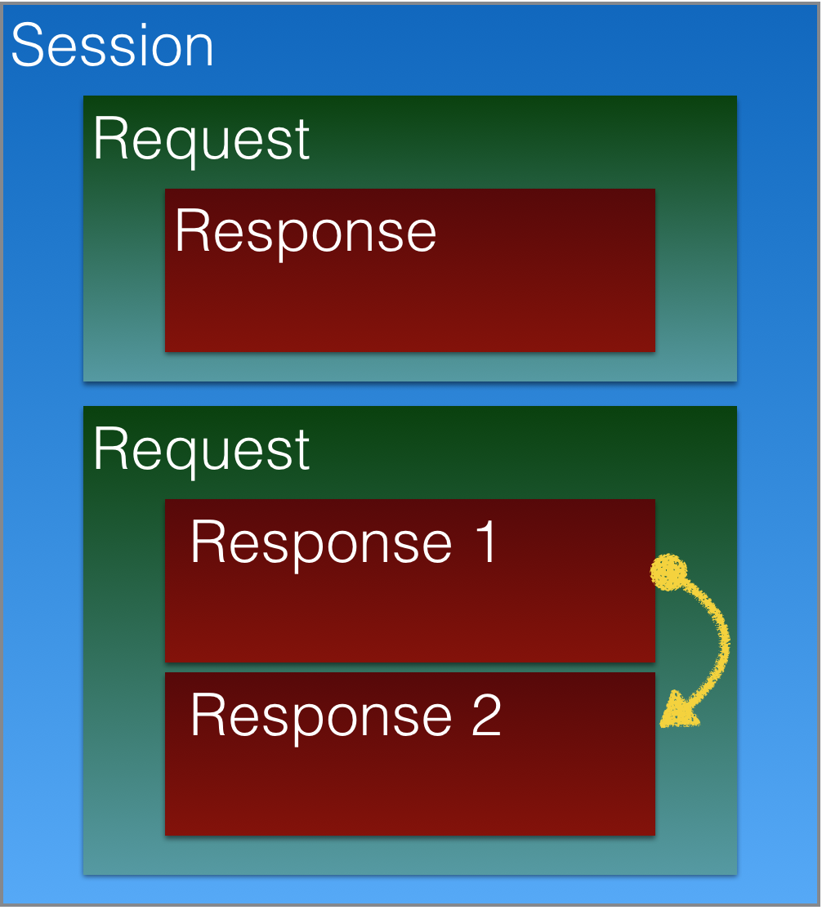

# YetAnotherHTTPStub

[](https://travis-ci.org/kinwahlai/YetAnotherHTTPStub)
[](https://github.com/Carthage/Carthage)
[](#donation)
[](#donation)

In many case, we need to mock the network response when we writing unit test that has network request, like calling an API.

This framework utilizes the URLProcotol to intercept the request and reply the response preset by developer.

This framework is inspired by [Mockingjay](https://github.com/kylef-archive/Mockingjay) and [Cuckoo](https://github.com/Brightify/Cuckoo)

## Key Concept 



### Details

- There should be only 1 session for each test case
- You can register as many request as you want for 1 session
- You can register as many response as you want for 1 request
- When a session starts, this framework will replace/swizzle the default _URLSessionConfiguration_ creation to inject the custom _URLProtocol_
- Also when a session starts, this framework will add the session to _XCTestObservationCenter_ to remove session on testCaseDidFinish 

## Installation

### Carthage

To use YetAnotherHTTPStub with [Carthage](https://github.com/Carthage/Carthage) add in your Cartfile this line:

```
github "kinwahlai/YetAnotherHTTPStub"
``` 

Don't forget to add the Framework into your project.

## Example

```swift
YetAnotherURLProtocol.stubHTTP { (session) in
    session.whenRequest(matcher: everything)
    .thenResponse(responseBuilder: jsonString("{\"hello\":\"world\"}"))
}
```

You start a session with `YetAnotherURLProtocol.stubHTTP` , `session.whenRequest` to register a request and `.thenResponse` to register a response.

```swift
YetAnotherURLProtocol.stubHTTP { (session) in
    session.whenRequest(matcher:  http(.get, uri: "/login"))
    .thenResponse(responseBuilder: jsonString("{\"success\":true}"))

    session.whenRequest(matcher:  http(.get, uri: "/getContact?page=\\d+&per_page=50"))
    .thenResponse(responseBuilder: jsonString(<Page 1 Response>))
    .thenResponse(responseBuilder: jsonString(<Page 2 Response>))
}
```

### Matcher

A matcher is a pure function that takes a _URLRequest_ and returns a boolean for checking if the stub request matches the request. And built-in matcher to help simplify the work.

```swift
func matcher(request:NSURLRequest) -> Bool {
  return true
}
```

#### Built-in matcher

- `everything` - Matches everything
- `nothing` - Match nothing
- `uri(url/path)` - Check if url or path with wildcard matches the request
- `http(method, url/path)` - Check if url or path with wildcard and method matches the request

### Builder

A builder is another pure function that takes a _URLRequest_ and returns a success or failure response

```swift
func matcher(request:NSURLRequest) -> StubResponse {
    let response = NSHTTPURLResponse(URL: request.URL, statusCode: 200, HTTPVersion: nil, headerFields: nil)!
    return .success(response: response, content: .noContent)
}
```

#### Built-in builder

- `failure(error)` 
- `http(status, headers, StubContent)`
- `jsonString(string, status, headers)`
- `json(body, status, headers)`
- `json(data, status, headers)`

## Donation

<table>
    <tr>
        <td colspan="2"> If you like my work on <b>YetAnotherHTTPStub</b> or to support open source, consider a small donation to my bitcoin address or paypal.me: </td>
    </tr>
    <tr>
        <td colspan="2"><a href="https://www.paypal.me/KinWahLai/10">Donate via Paypal.me</a></td>
    </tr>
    <tr>
        <td>
            
        </td>
        <td><a href="bitcoin:1PdU216MXW7QTvj1pB4PBD4ztD4vh88bnJ?amount=0.005">1PdU216MXW7QTvj1pB4PBD4ztD4vh88bnJ</a></td>
    </tr>
</table>

## License

MIT License

Copyright (c) 2017 Kin-Wah Lai

Permission is hereby granted, free of charge, to any person obtaining a copy
of this software and associated documentation files (the "Software"), to deal
in the Software without restriction, including without limitation the rights
to use, copy, modify, merge, publish, distribute, sublicense, and/or sell
copies of the Software, and to permit persons to whom the Software is
furnished to do so, subject to the following conditions:

The above copyright notice and this permission notice shall be included in all
copies or substantial portions of the Software.

THE SOFTWARE IS PROVIDED "AS IS", WITHOUT WARRANTY OF ANY KIND, EXPRESS OR
IMPLIED, INCLUDING BUT NOT LIMITED TO THE WARRANTIES OF MERCHANTABILITY,
FITNESS FOR A PARTICULAR PURPOSE AND NONINFRINGEMENT. IN NO EVENT SHALL THE
AUTHORS OR COPYRIGHT HOLDERS BE LIABLE FOR ANY CLAIM, DAMAGES OR OTHER
LIABILITY, WHETHER IN AN ACTION OF CONTRACT, TORT OR OTHERWISE, ARISING FROM,
OUT OF OR IN CONNECTION WITH THE SOFTWARE OR THE USE OR OTHER DEALINGS IN THE
SOFTWARE.


